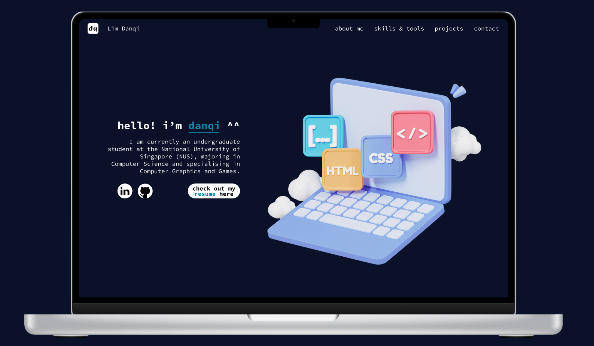

# Personal Portfolio Website
This website was built by me to showcase my skills and projects to potential recruiters. A link to the live website is [here](limdanqi.com). A Figma prototype is also created [here](https://www.figma.com/file/KXxARJn2gs3H2bl9c6Qzzu/prototype-v0?type=design&node-id=0%3A1&mode=design&t=32mPNf1jdt1TOABc-1)
.

## Tech Stack
* Microsoft Visual Studio Code
* HTML
* CSS
* Vanilla JavaScript
* Figma

## Planned Improvements
* Make website responsive on all devices
* Organise code
* Cosmetic fixes
    * Scroll up button does not have transparent background
    * Improving UI of slides container
    * Fixing slides height such that the height of each project remain fixed even if the images have different heights

## Acknowledgements

basic framework: https://www.freecodecamp.org/news/how-to-build-a-developer-portfolio-website/

colour scheme: https://coolors.co/000000-0a1128-1282a2-ffffff

slideshow: https://www.w3schools.com/howto/howto_js_slideshow.asp

logos: https://commons.wikimedia.org/ 

icons and logos: https://www.flaticon.com/authors/freepik

font: https://fonts.google.com/specimen/Source+Code+Pro

sprites: https://www.tutorialrepublic.com/css-tutorial/css-sprites.php